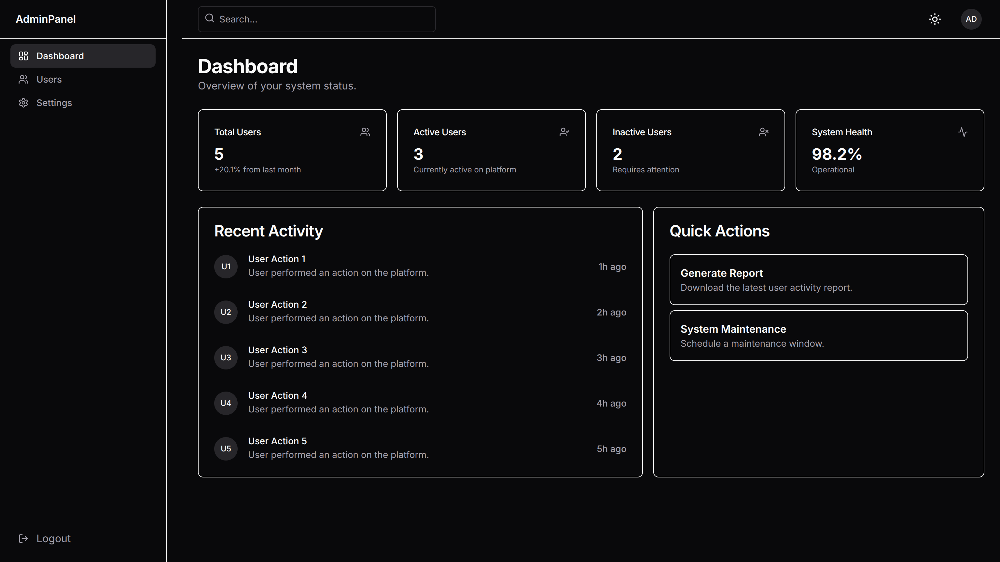
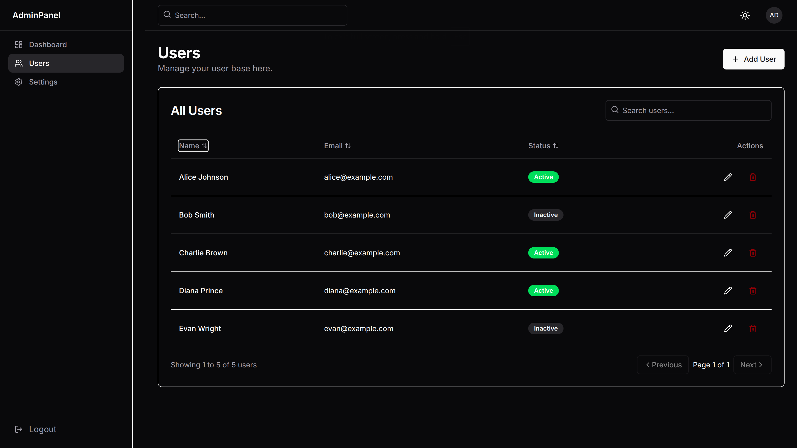
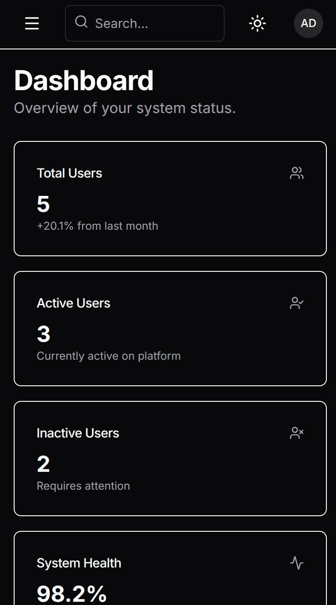

# SaaS Admin Dashboard – Next.js + TypeScript

A modern, responsive Admin Dashboard built with Next.js, TypeScript, and Tailwind CSS. This project demonstrates advanced frontend capabilities including complex state management, interactive data tables, and a polished UI architecture.

**[Live Demo](https://admin-dashboard-ui-nine.vercel.app/dashboard)**

## Screenshots

### Desktop View

*Dashboard overview with metrics cards, recent activity, and quick actions*


*User management table with search, filtering, and inline actions*

### Mobile View


*Responsive mobile layout with collapsible sidebar and optimized card layout*

## Features

| Feature | Description |
|---------|-------------|
| **Dashboard Overview** | Metrics cards showing Total Users, Active Users, Inactive Users, and System Health with percentage indicators |
| **Recent Activity Feed** | Timeline view of user actions with timestamps and activity descriptions |
| **Quick Actions** | One-click access to Generate Report and System Maintenance scheduling |
| **Interactive Data Table** | User management table with sorting, search, and real-time filtering by name or email |
| **Modal Form** | Add and edit users through a clean modal interface with client-side validation |
| **Theme Toggle** | Built-in Dark/Light mode with smooth transitions and persistent preferences |
| **Sidebar Layout** | Responsive collapsible sidebar with navigation and mobile-optimized hamburger menu |
| **CRUD Operations** | Full Create, Read, Update, Delete functionality for user management |
| **Status Badges** | Visual indicators for user status (Active/Inactive) with color-coded badges |
| **Settings Page** | Profile management, appearance customization, and account settings |
| **Responsive Design** | Fully optimized for desktop, tablet, and mobile devices |
| **Mock API** | Simulated backend using Next.js API routes for realistic data operations |

## Tech Stack

| Technology | Purpose |
|------------|---------|
| **[Next.js 14](https://nextjs.org/)** | React framework with App Router for server and client components |
| **[TypeScript](https://www.typescriptlang.org/)** | Type-safe development with enhanced IDE support |
| **[Tailwind CSS](https://tailwindcss.com/)** | Utility-first CSS framework for rapid UI development |
| **[Zustand](https://github.com/pmndrs/zustand)** | Lightweight state management for global app state |
| **[React Context](https://react.dev/reference/react/useContext)** | Context API for theme and sidebar state management |
| **[Lucide React](https://lucide.dev/)** | Modern icon library with consistent design |

## Installation

1. **Clone the repository:**
   ```bash
   git clone https://github.com/Dev-5804/admin-dashboard-ui.git
   cd admin-dashboard-ui
   ```

2. **Install dependencies:**
   ```bash
   npm install
   ```

3. **Run the development server:**
   ```bash
   npm run dev
   ```

4. **Open your browser:**
   Navigate to [http://localhost:3000](http://localhost:3000) to view the dashboard.

## Pages

The application includes the following pages:

- **`/dashboard`** - Main dashboard with metrics, recent activity, and quick actions
- **`/dashboard/users`** - User management with table, search, and CRUD operations
- **`/dashboard/settings`** - Account settings, profile information, and theme preferences

## Usage

### Managing Users
1. Navigate to the **Users** page from the sidebar
2. Click **Add User** to create a new user
3. Use the search bar to filter users by name or email
4. Click the edit icon to modify user details
5. Click the delete icon to remove a user

### Dashboard Metrics
- View total user count with growth percentage
- Monitor active vs inactive users
- Check system health status
- Review recent user activity timeline

### Customizing Theme
1. Click the theme toggle button in the top bar (sun/moon icon)
2. Or go to **Settings** page and select Light/Dark theme
3. Theme preference is persisted across sessions

## Folder Structure

```
/app
  /dashboard      # Main dashboard pages
  /api            # Mock API routes
/components       # Reusable UI components (Sidebar, Table, Modal, etc.)
/lib              # Utility functions and types
/store            # Zustand state management stores
/styles           # Global styles and Tailwind configuration
```

## API Endpoints (Mock)

The project uses Next.js API routes to simulate a backend:

- `GET /api/users`: Fetch all users.
- `POST /api/users`: Create a new user.
- `PATCH /api/users`: Update an existing user.
- `DELETE /api/users`: Remove a user.

*Note: Data is stored in-memory and will reset on application restart.*

## License

This project is open source and available under the [MIT License](LICENSE).
